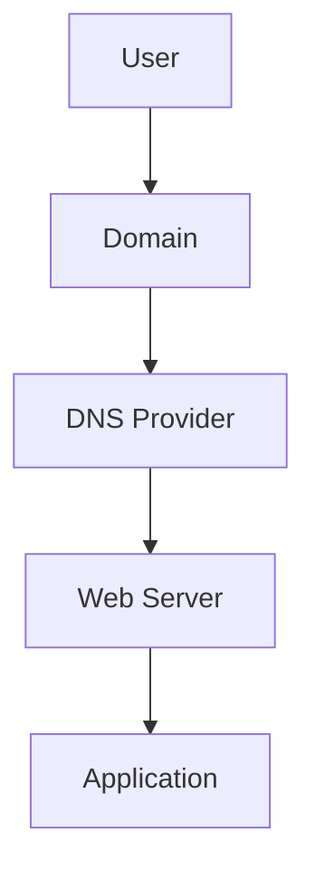

# **POC on DNS (Domain Name System)**
| Created        | Last updated      | Version         | author|  Internal Reviewer | L0 | L1 | L2|
|----------------|----------------|-----------------|-----------------|-----|------|----|----|
| 2025-04-30  | 2025-05-01   |     Version 1         |  Mohamed Tharik |Priyanshu|Khushi|Mukul Joshi |Piyush Upadhyay|

## Purpose 
This document outlines the Proof of Concept (POC) for acquiring a domain name and setting up a Domain Name System (DNS) configuration for an application. The goal is to demonstrate the process of linking a domain with an application hosted on a server, ensuring it is accessible through a user-friendly domain name instead of an IP address.

## Table of Contents 

## Introduction 
DNS (Domain Name System) is a critical service that allows users to access applications and services on the internet using human-readable domain names (like www.example.com) rather than complex numerical IP addresses. The purpose of this POC is to acquire a domain, configure the DNS, and set it up for an application to enable its access via the domain.

The POC will cover:

- Domain acquisition
- DNS configuration
- Linking the domain to an application hosted on a server

## What is DNS?
DNS stands for Domain Name System translates domain names (like www.example.com) into IP addresses (like 192.168.1.1), enabling browsers to locate websites. It allows users to access websites using easy-to-remember names instead of numeric IP addresses.For more detailed about DNS refer to this repository [link]()

## Why DNS Setup is Important for an Application?
**1. User-Friendliness**: Users can easily access an application using a domain name.
**2. Branding**: Domains provide a professional appearance and brand recognition.
**3. SEO**: Search engines prefer domains over raw IP addresses, helping improve search rankings.
**4. Scalability**: DNS records make it easier to scale an application by providing flexibility in routing traffic.

## Prerequisites
Before proceeding with this POC, ensure you have the following prerequisites:

- **Domain Name**: You need to either purchase or own a domain. (For example, from registrars like GoDaddy, Namecheap, Google Domains).
- **Server**: A running server instance (e.g., EC2, DigitalOcean, or on-premise server) where your application is hosted.
- **Application**: Your application must be running and accessible via an IP address or a local URL.
- **DNS Provider**: A DNS service provider like AWS Route 53, Cloudflare, or Google DNS. Some domain registrars also provide DNS services.
- **Basic Networking Knowledge**: Familiarity with concepts like A records, CNAME, TTL, etc.

## Architecture
The architecture for this POC involves the following components:

- **Domain Registrar**: The service where you purchase or manage your domain.
- **DNS Provider**: The service that handles DNS record management.
- **Web Server**: The server hosting your application.
- **Application**: The actual application accessible via a web browser.

## Architecture Overview

## Step-by-Step Guide for the POC
### Step 1: Acquire a Domain
- Choose a domain registrar (e.g., GoDaddy, Namecheap, Google Domains).
- Search for the desired domain name and purchase it.
- Once purchased, you should have access to the domain's DNS settings through your registrar's control panel.

### Step 2: Set Up DNS Provider
- If your domain registrar provides DNS management, you can use their DNS service. Otherwise, you may need to use a third-party DNS provider (e.g., AWS Route 53, Cloudflare).
- Log in to the DNS provider's management console and create a new DNS zone or manage your existing domain.

### Step 3: Configure DNS Records
**1.Create an A Record**:

- Go to your DNS provider's console and add an "A" record.
- The name field is typically @ for the root domain or www for a subdomain.
- The value field should be the public IP address of your server.
- TTL (Time To Live) can be left at the default (e.g., 3600 seconds or 1 hour).

**2. Optional: Create a CNAME Record**:
- If you want to point a subdomain (e.g., app.example.com) to another domain, use a CNAME record.
- The name would be the subdomain (e.g., app), and the value would be the target domain (e.g., myapp.example.com).

**3. Configure MX Records (if applicable)**:

- If your application uses email functionality, configure MX records to point to your email service provider.

### Step 4: Set Up Your Web Server
Ensure that your web server is configured to listen on the correct port (usually port 80 for HTTP or 443 for HTTPS). If you're using an application like Apache or Nginx, make sure the server is set to serve your application under the domain you’ve just configured.

### Step 5: Test the Setup
Once the DNS records are updated, which can take anywhere from a few minutes to several hours, test the domain in a web browser:
- Open your browser.
- Type in the domain (e.g., www.myapp.com).
- Verify that the application loads correctly.

### Step 6: Secure the Domain (Optional)
For added security, especially for production environments, consider enabling HTTPS by setting up an SSL/TLS certificate for your domain.

- You can use free SSL certificates from Let's Encrypt or purchase them from your domain provider.
- Set up HTTPS redirection on your server (e.g., from HTTP to HTTPS).

## Best Practices
- **Use TTL Wisely**: Set appropriate TTL values. Lower TTLs (e.g., 300 seconds) allow quicker updates to DNS records, but higher values (e.g., 3600 seconds) can reduce the load on your DNS provider.
- **Regular Backups**: Regularly backup your DNS configuration to avoid accidental loss.
- **Use Subdomains for Specific Services**: Use subdomains for different services (e.g., api.myapp.com, mail.myapp.com) for better organization.
- **Monitor DNS Health**: Use DNS monitoring tools to ensure your records are correctly resolving and your application is always reachable.
- **Use a CDN**: If you expect high traffic, consider using a Content Delivery Network (CDN) like Cloudflare to cache your content and improve performance.

## Conclusion 
In this POC, we acquired a domain, configured DNS, and linked it to our application. This showed how DNS enables user-friendly access and supports branding, SEO, and scalability. For production, use SSL, CDNs, and monitor DNS health for better performance and security.

## Contact Information
| Name | Email address         |
|------|------------------------|
| Mohamed Tharik  | md.tharik.sanaatak@mygurukulam.co    |

## Reference
| Link                                                                 | Description                                               |
|----------------------------------------------------------------------|-----------------------------------------------------------|

