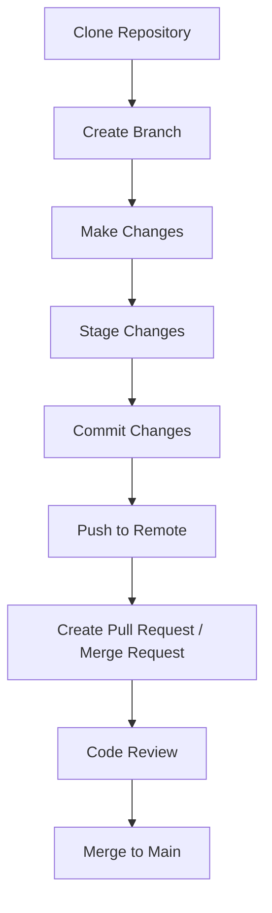

# **VCS Setup Installation Guide** 

| Created        | Last updated      | Version         | author|  Internal Reviewer | L0 | L1 | L2|
|----------------|----------------|-----------------|-----------------|-----|------|----|----|
| 2025-04-23  | 2025-04-28   |     Version 1         |  Mohamed Tharik |Priyanshu|Khushi|Mukul Joshi |Piyush Upadhyay|

## Purpose

The purpose of this document is to:

- Provide an overview of Version Control Systems (VCS).
- Explain the key features and benefits of using VCS.
- Guide users on how to set up and configure VCS.
- Detail the VCS workflow in a typical software development environment.
- Provide a Proof of Concept (PoC) to demonstrate how VCS can be implemented and used.

## Table of Contents

- [Introduction](#introduction)
- [Key Features of VCS](#key-features-of-vcs)
- [VCS Setup Installation and Configuration](#vcs-setup-installation-and-configuration)
  - [Choose a VCS](#choose-a-vcs)
  - [Install VCS Software](#install-vcs-software)
  - [Initialize a Repository](#initialize-a-repository)
  - [Connect to a Remote Repository](#connect-to-a-remote-repository)
  - [Commit Changes](#commit-changes)
  - [Push to Remote Repository](#push-to-remote-repository)
- [VCS Workflow](#vcs-workflow)
- [Benefits of VCS](#benefits-of-vcs)
- [Conclusion](#conclusion)
- [Contact Information](#contact-information)
- [References](#references)

## Introduction 

A Version Control System (VCS) is a tool that helps software developers track and manage changes to source code over time. It allows multiple users to work on the same project, maintain historical versions of the code, and manage different branches of development without overwriting each other's work. VCS is an essential part of modern software development, especially in collaborative projects.

## Key Features of VCS

| **Feature**            | **Description**                                                                                                                                      |
|------------------------|------------------------------------------------------------------------------------------------------------------------------------------------------|
| **Track Changes**       | VCS records every change made to the codebase, including who made the change, when it was made, and what the change was.                             |
| **Branching and Merging** | Developers can work on separate branches and later merge their changes back into the main codebase.                                                |
| **Revert Changes**      | If an error is introduced, VCS allows reverting to a previous version of the code.                                                                 |
| **Collaboration**       | Multiple developers can work on different parts of a project simultaneously without interfering with each other’s work.                             |
| **History Management**  | The system stores historical versions of the project, allowing developers to review previous versions of the code.                                  |
| **Conflict Resolution** | VCS helps manage and resolve conflicts when changes from different developers overlap.                                                             |

## VCS Setup Installation and Configuration

### Choose a VCS
There are two types of VCS:

- **Centralized Version Control System (CVCS)**: In this system, all files are stored in a central repository. Examples include Subversion (SVN).
  
- **Distributed Version Control System (DVCS)**: Each developer has a local copy of the repository, and changes are later pushed to the central repository. Examples include Git, Mercurial.

### Install VCS Software
To use a VCS, install the relevant software on your machine. For example, to set up **Git**, you would install it using a package manager or download it from the official website.

### Initialize a Repository
After installing the VCS software, initialize a new repository within your project. This marks the project folder as a version-controlled repository.

### Connect to a Remote Repository
If you’re collaborating, you will connect to a remote repository on platforms like GitHub, GitLab, or Bitbucket. This allows multiple developers to work on the same codebase.

### Commit Changes
Once changes are made to the codebase, they need to be committed to the version control system. A commit records the changes and allows tracking of who made them and when.

### Push to Remote Repository
After committing changes locally, they are pushed to the remote repository to share them with other team members. This ensures that the entire team has access to the latest changes.

## VCS Workflow

## Benefits of VCS

| Benefit           | Description                                                                 |
|-------------------|-----------------------------------------------------------------------------|
| **Collaboration**  | Facilitates teamwork and smooth collaboration among developers, even if they are in different locations. |
| **Backup**         | Acts as a backup for the entire project, reducing the risk of losing work.  |
| **Code Integrity** | Protects the integrity of the project by allowing developers to roll back to a known stable version. |
| **Efficiency**     | Improves development efficiency by reducing the time spent managing conflicts and coordinating changes. |
| **Audit and Tracking** | Enables auditing and tracking of the changes, providing insights into the history and evolution of the codebase. |
| **Integration**    | Easily integrates with other tools like continuous integration/continuous deploymen

## Conclusion

A Version Control System (VCS) is essential for modern software development, enabling collaboration, tracking changes, and maintaining code integrity. By following the setup and workflow guidelines, teams can effectively manage code across environments and ensure smooth development. Implementing VCS enhances efficiency and reliability in software delivery.

## Contact Information

| Name | Email address         |
|------|------------------------|
| Mohamed Tharik  | md.tharik.sanaatak@mygurukulam.co    |

## References

| Links                                                                                                                                                                                                                     | Descriptions                                                                                              |
|---------------------------------------------------------------------------------------------------------------------------------------------------------------------------------------------------------------------------|-----------------------------------------------------------------------------------------------------------|
|[Install Git - GitHub Guides](https://github.com/git-guides/install-git)                | Official GitHub guide for installing Git          |
[Introduction to VCS](https://www.geeksforgeeks.org/version-control-systems/)|In this we can get to know the detailed VCS types,key features etc...| 
