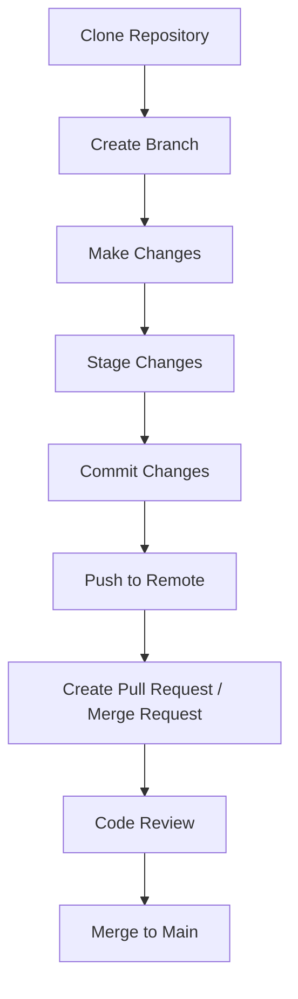

# **VCS Setup Installation Guide** 

| Created        | Last updated      | Version         | author|  Internal Reviewer | L0 | L1 | L2|
|----------------|----------------|-----------------|-----------------|-----|------|----|----|
| 2025-04-23  | 2025-04-28   |     Version 1         |  Mohamed Tharik |Priyanshu|Khushi|Mukul Joshi |Piyush Upadhyay|
| 2025-04-23  | 2025-04-29   |     Version 2         |  Mohamed Tharik |Priyanshu|Khushi|Mukul Joshi |Piyush Upadhyay|
| 2025-04-23  | 2025-04-30   |     Version 3         |  Mohamed Tharik |Priyanshu|Khushi|Mukul Joshi |Piyush Upadhyay|

## Purpose

The purpose of this document is to:

- Provide an overview of Version Control Systems (VCS).
- Explain the key features and benefits of using VCS.
- Guide users on how to set up and configure VCS.
- Detail the VCS workflow in a typical software development environment.
- Provide a Proof of Concept (PoC) to demonstrate how VCS can be implemented and used.

## Table of Contents

- [Introduction](#introduction)
- [What is Vcs?](#what-is-vcs)
- [VCS Setup Installation and Configuration Guide](#vcs-setup-installation-and-configuration-guide)
  - [Choose a VCS](#1-choose-a-vcs)
  - [Install VCS Software](#2-install-vcs-software)
  - [Initialize a Repository](#3-initialize-a-repository)
  - [Connect to a Remote Repository](#4-connect-to-a-remote-repository)
  - [Commit Changes](#5-commit-changes)
  - [Push to Remote Repository](#6-push-to-remote-repository)
- [VCS Workflow](#vcs-workflow)
- [VCS Workflow Diagram](#vcs-workflow-diagram)
- [Conclusion](#conclusion)
- [Contact Information](#contact-information)
- [References](#references)

## Introduction 

A Version Control System (VCS) is a tool that helps software developers track and manage changes to source code over time. It allows multiple users to work on the same project, maintain historical versions of the code, and manage different branches of development without overwriting each other's work. VCS is an essential part of modern software development, especially in collaborative projects.

## What is VCS?
VCS (Version Control System) is a tool that tracks and manages changes to files over time, helps teams collaborate, and allows reverting to earlier versions if needed.For more detailed about VCS refer to this repository [link](https://github.com/Cloud-NInja-snaatak/Documentation/blob/tharik_scrum57/commonstack/vcs/Documentation.md).

## VCS Setup Installation and Configuration Guide

### 1. Choose a VCS
There are two types of VCS:
      
- **Centralized Version Control System (CVCS)**: In this system, all files are stored in a central repository. Examples include Subversion (SVN).
      
- **Distributed Version Control System (DVCS)**: Each developer has a local copy of the repository, and changes are later pushed to the central repository. Examples include Git, Mercurial.

### 2. Install VCS Software
To use a VCS, install the relevant software on your machine. For example, to set up **Git**, you would install it using a package manager or download it from the official website.

### 3. Initialize a Repository
After installing the VCS software, initialize a new repository within your project. This marks the project folder as a version-controlled repository.

### 4. Connect to a Remote Repository
If you’re collaborating, you will connect to a remote repository on platforms like GitHub, GitLab, or Bitbucket. This allows multiple developers to work on the same codebase.

### 5. Commit Changes
Once changes are made to the codebase, they need to be committed to the version control system. A commit records the changes and allows tracking of who made them and when.

### 6. Push to Remote Repository
After committing changes locally, they are pushed to the remote repository to share them with other team members. This ensures that the entire team has access to the latest changes.

## VCS Workflow 
- **Clone Repository:** Copy the remote code to your local machine.
- **Create Branch:** Start a new branch for your feature or fix.
- **Make Changes:** Modify code or files as needed.
- **Stage Changes:** Mark changes to be included in the next commit.
- **Commit Changes:** Save the staged changes with a message.
- **Push to Remote:** Upload your branch and commits to the remote repo.
- **Create Pull Request / Merge Request:** Ask to merge your branch into the main branch.
- **Code Review:** Team members review your code for quality and correctness.
- **Merge to Main:** Integrate your changes into the main codebase.

## VCS Workflow Diagram 

## Conclusion

A Version Control System (VCS) is essential for modern software development, enabling collaboration, tracking changes, and maintaining code integrity. By following the setup and workflow guidelines, teams can effectively manage code across environments and ensure smooth development. Implementing VCS enhances efficiency and reliability in software delivery.

## Contact Information

| Name | Email address         |
|------|------------------------|
| Mohamed Tharik  | md.tharik.sanaatak@mygurukulam.co    |

## References

| Links                                                                                                                                                                                                                     | Descriptions                                                                                              |
|---------------------------------------------------------------------------------------------------------------------------------------------------------------------------------------------------------------------------|-----------------------------------------------------------------------------------------------------------|
|[Install Git - GitHub Guides](https://github.com/git-guides/install-git)                | Official GitHub guide for installing Git          |
[Introduction to VCS](https://www.geeksforgeeks.org/version-control-systems/)|In this we can get to know the detailed VCS types,key features etc...| 
